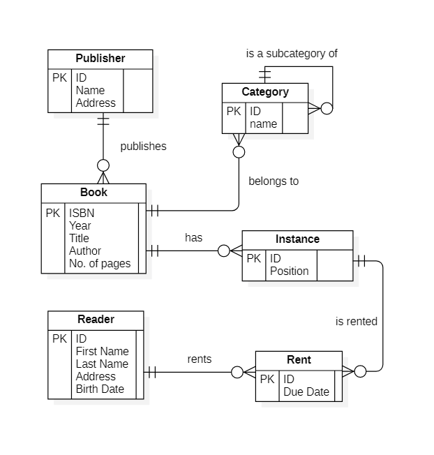
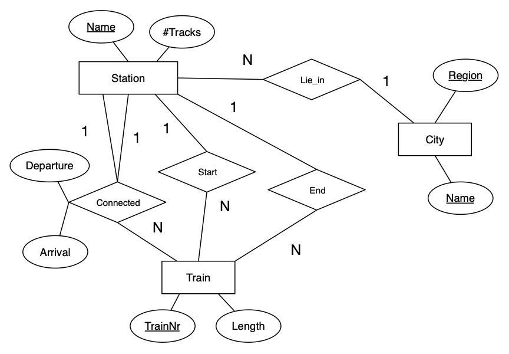
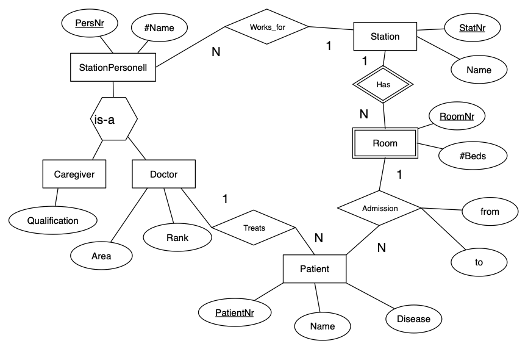

## Relation Model

Foreign Key обозночается **так**

Candidate Key обозночается **так**

## Задание 1.

Почему любое отношение в реляционной схеме имеет по крайней мере один ключ?

Потому что каждое значение в отношение в реляционной счехеме должно быть уникальным.

## Задание 2.

### Задача 1.

#### 1. Relations

Book = {[__ISBN: string__, Year: string, Title: string, Author: string, No-of-Pages: integer, *Category-ID: integer*, *Publisher-ID: integer*]}

Publisher = {[__Publisher-ID: integer__, Name: string, Address: string]}

Category = {[__Category-ID: integer__, Name: string, *Parent-ID: integer*]}

Instance = {[__Instance-ID: integer__, *ISBN: integer*, Position: integer]}

Reader = {[__Reader-ID: integer__, First-Name: string, Last-Name: string, Address: string, Birth-Date: datetime]}

Rented = {[__ID: integer__, *Reader-ID: integer*, *Instance-ID: integer*, Due-Date: datetime]}

### Задача 2.

#### 2.1 Relations

Apartment = {[__Apartment: string__, *Street: string*]}

Street = {[__Street: string__, *Building: string*]}

Building = {[__Building: string__, *City-Name: string*]}

City = {[__City-Name: string__, *Country-Name: string*]}

Country = {[__Country-Name: string__]}

#### 2.2 Relations

Match = {[__Match-ID: integer__, *Team1-ID: integer*, *Team2-ID: integer*, *Referee-ID: integer*]}

Referee = {[__Referee-ID: integer__, Name: string]}

Team = {[__Team-ID: integer__, Name: string]}

#### 2.4 Relations

Man = {[__Man-ID: integer__, *Father-ID: integer*, *Mother-ID: integer*]}

Woman = {[__Woman-ID: integer__, *Father-ID: integer*, *Mother-ID: integer*]}

### Задача 3.

#### Relations

Entity = {[__Entity-ID: integer__, Name: string]}

Attribute = {[__Attribute-ID: integer__, Name: integer, isPartOfKey: boolean, *Entity-ID: integer*]}

Role = {[__Role-ID: integer__, Name: string, *Entity-ID: integer*]}

Relationship = {[__Relationship-ID: integer__, *Role1-ID: integer*, *Role2-ID: integer*, Relationship-Attribute: string]}

## Задание 3.

### Схема 1.

#### Relations

Station: {[__Station-Name: string__, *City-Name: string*, *Region: string*, #Tracks: integer]}

City: {[__City-Name: string__, __Region: string__]}

Train: {[__TrainNr: integer__, Length: integer, *Start-Station: string*, *End-Station: string*, *Connection-ID: integer*]}

Connection: {[__Connection-ID: integer__, *Start-Station: string*, *End-Station: string*, Departure: datetime, Arrival: datetime]}

### Схема 2.

#### Relations

StationPersonell: {[__PersNr: integer__, PersName: string, *StatNr: integer*]}

Station: {[__StatNr: integer__, Name: string]}

Caregiver: {[__PersNr: integer__, #Name: string, Qualification: string]}

Doctor: {[__DoctorNr: integer__, #Name: string, Area: string, Rank: string]}

Patient: {[__PatientNr: integer__, Name: string, Disease: string, *DoctorNr: integer*, *Admission-ID: integer*]}

Room: {[__RoomNr: integer__, #Beds: integer, *StatNr: integer*]}

Admission: {**Admission-ID: integer**, RoomNr: integer, PatientNr: integer, from: string, to: string]}
